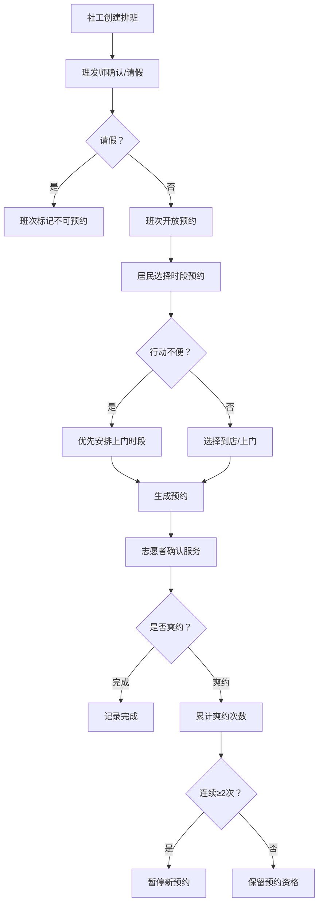

## 1. 产品概述

社区便民理发预约系统，帮助社工管理理发师排班，居民在线预约上门或到店理发，志愿者跟踪服务完成情况。通过优先安排行动不便居民上门、请假自动暂停预约、连续爽约限制等功能，让社区理发服务有序高效。

## 2. 核心功能

### 2.1 用户角色

| 角色 | 注册方式 | 核心权限 |
|------|----------|----------|
| 社工 | 系统预设 | 维护理发师排班、审批请假、查看预约统计 |
| 居民 | 系统预设 | 选择时段预约理发（上门/到店）、查看自己的预约 |
| 志愿者 | 系统预设 | 记录预约完成/爽约、查看当日排班 |
| 理发师 | 系统预设 | 查看自己的班次、提交请假 |

### 2.2 功能模块

1. **排班管理页**：社工为理发师创建/编辑班次，理发师请假标记
2. **预约页**：居民按日期和理发师选择时段，标记上门/到店，行动不便居民优先
3. **预约管理页**：志愿者查看当日预约列表，标记完成或爽约
4. **仪表盘首页**：当日排班概览、预约统计、爽约提醒

### 2.3 页面详情

| 页面名称 | 模块名称 | 功能描述 |
|----------|----------|----------|
| 仪表盘 | 今日概览 | 显示当日排班理发师、预约数、待服务数、爽约提醒 |
| 仪表盘 | 快捷操作 | 快速跳转到排班、预约、管理页面 |
| 排班管理 | 班次列表 | 按周/日展示理发师排班，支持新增/编辑/删除班次 |
| 排班管理 | 请假管理 | 理发师请假后该班次不可预约，已预约自动提示改约 |
| 预约 | 时段选择 | 按日期展示可用时段，区分上门/到店 |
| 预约 | 上门优先 | 行动不便居民标记，预约时优先安排上门时段 |
| 预约 | 爽约检查 | 连续爽约2次的居民禁止新预约，提示联系社工 |
| 预约管理 | 当日预约 | 按理发师分组展示当日预约列表 |
| 预约管理 | 状态更新 | 志愿者标记完成/爽约，爽约自动累计 |

## 3. 核心流程

## 4. 用户界面设计

### 4.1 设计风格

- **主色调**：暖橙色 (#F97316) 代表社区温暖，搭配深灰 (#1F2937) 和米白 (#FFFBEB)
- **辅助色**：翠绿 (#10B981) 表示完成，玫红 (#F43F5E) 表示爽约/警告
- **按钮风格**：圆角 8px，轻微阴影，hover 时提升阴影层级
- **字体**：正文使用系统字体，标题使用 Noto Sans SC
- **布局**：左侧导航栏 + 右侧内容区，卡片式布局
- **图标风格**：Lucide 线性图标

### 4.2 页面设计概览

| 页面名称 | 模块名称 | UI 元素 |
|----------|----------|---------|
| 仪表盘 | 今日概览 | 4张统计卡片（排班/预约/待服务/爽约），渐变背景 |
| 仪表盘 | 爽约提醒 | 红色警告卡片，列出被暂停预约的居民 |
| 排班管理 | 班次日历 | 周视图网格，每格显示理发师和时段，可点击编辑 |
| 排班管理 | 请假标记 | 班次卡片覆盖半透明红色遮罩 + "请假"标签 |
| 预约 | 时段网格 | 按理发师分列，按时段分行，可用=绿色/已满=灰色/请假=红色 |
| 预约 | 上门标签 | 行动不便居民预约卡右上角橙色"上门优先"徽章 |
| 预约管理 | 预约列表 | 按理发师折叠分组，每条显示居民/时间/类型，状态按钮 |

### 4.3 响应式

- 桌面优先设计，最小宽度 1024px
- 平板适配：导航栏收缩为图标模式
- 移动端：底部标签栏导航，卡片堆叠

### 4.4 3D 场景

不适用
