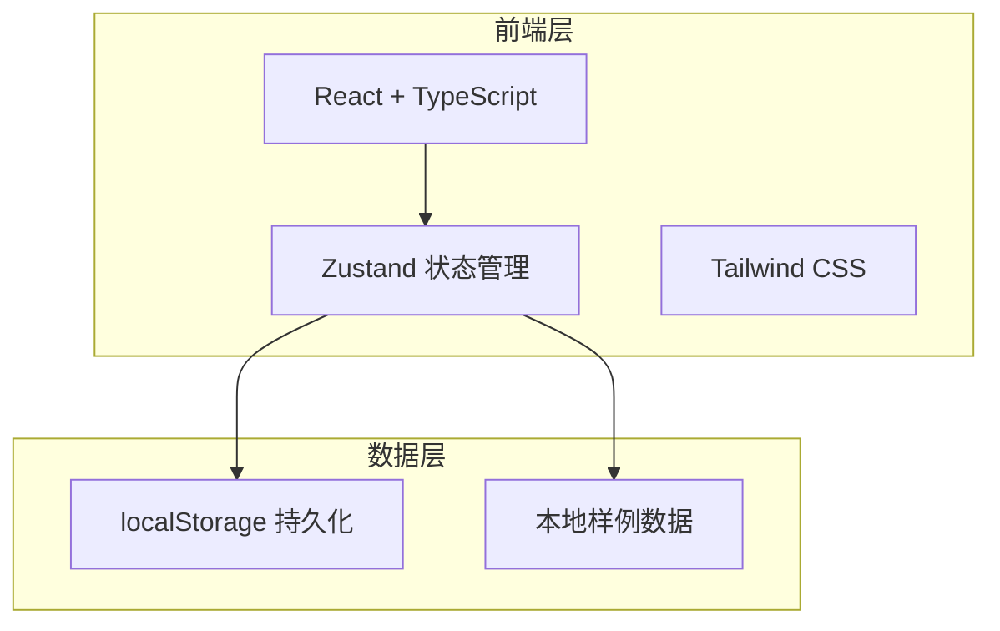
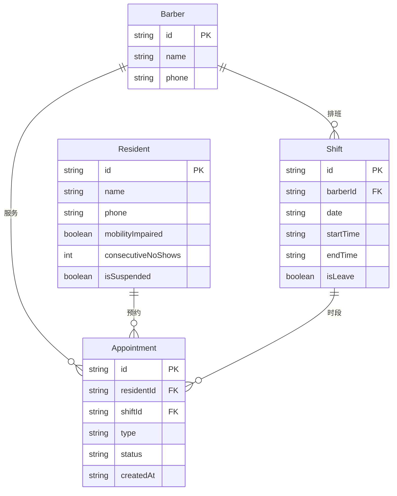

## 1. 架构设计



纯前端架构，所有数据通过 Zustand 管理并持久化到 localStorage，无需后端服务。

## 2. 技术说明

- **前端**：React@18 + TypeScript + Vite + Tailwind CSS
- **初始化工具**：vite-init
- **后端**：无（本地样例数据）
- **数据库**：无（localStorage + 内存状态）
- **状态管理**：Zustand
- **路由**：react-router-dom
- **图标**：lucide-react

## 3. 路由定义

| 路由 | 用途 |
|------|------|
| `/` | 仪表盘首页，今日概览与快捷操作 |
| `/schedule` | 排班管理，理发师班次维护与请假 |
| `/booking` | 预约页面，居民选择时段预约 |
| `/manage` | 预约管理，志愿者记录完成/爽约 |

## 4. API 定义

无后端 API，所有数据操作通过 Zustand store 方法完成。

### Store 方法定义

```typescript
interface BookingStore {
  // 班次相关
  shifts: Shift[]
  addShift: (shift: Omit<Shift, 'id'>) => void
  updateShift: (id: string, data: Partial<Shift>) => void
  deleteShift: (id: string) => void
  setLeave: (shiftId: string, isLeave: boolean) => void

  // 预约相关
  appointments: Appointment[]
  createAppointment: (data: Omit<Appointment, 'id' | 'status'>) => string | null
  completeAppointment: (id: string) => void
  noShowAppointment: (id: string) => void

  // 居民相关
  residents: Resident[]
  isResidentSuspended: (residentId: string) => boolean

  // 理发师相关
  barbers: Barber[]
}
```

## 5. 服务端架构

不适用

## 6. 数据模型

### 6.1 数据模型定义



### 6.2 数据定义语言

```typescript
interface Barber {
  id: string
  name: string
  phone: string
}

interface Shift {
  id: string
  barberId: string
  barberName: string
  date: string
  startTime: string
  endTime: string
  isLeave: boolean
  maxAppointments: number
}

interface Resident {
  id: string
  name: string
  phone: string
  mobilityImpaired: boolean
  consecutiveNoShows: number
  isSuspended: boolean
}

type AppointmentType = 'home' | 'instore'
type AppointmentStatus = 'pending' | 'completed' | 'noshow'

interface Appointment {
  id: string
  residentId: string
  residentName: string
  shiftId: string
  barberId: string
  barberName: string
  type: AppointmentType
  status: AppointmentStatus
  date: string
  startTime: string
  endTime: string
  createdAt: string
}
```
